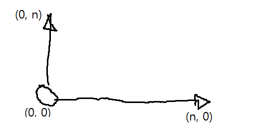
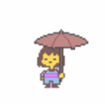
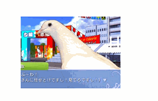
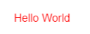
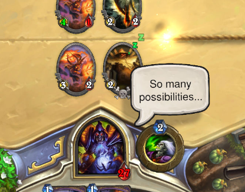

cocos2d-js-guide
====
cocos2d-js는 자바스크립트로 HTML5환경에서 동작하는 게임을 작성할 수 있는 게임 엔진입니다. 전체적인 API가 `cocos2d-x`와 매우 비슷하므로, cocos2d-js를 익히면 cocos2d-x에 빠르게 적응할 수 있고, 그 반대의 경우에도 마찬가지입니다.<br>
이 문서에서는 cocos2d-js를 이용하여 간단한 웹 게임을 만드는 방법을 소개합니다.

자바스크립트에 대해서
----
* 자바스크립트는 보통 2개의 스페이스로 `indent`를 표기합니다.
* 줄 끝에 세미콜론(`;`)은 강제 사항이 아니나, 보통 붙이는것이 일반적입니다.
* 만약 코코스 화면이 뜨지 않고, 하얀 화면만 보인다면 작성한 자바스크립트에 문법 오류가 있는 경우입니다. 이 경우 개발자 도구(F12)를 눌러 콘솔을 확인해주세요.
* `printf` 역할을 하는 함수는 `console.log()` 입니다. 이는 개발자 도구의 `console` 탭에서 보여집니다.
* 만약 문자열과 숫자를 합치고 싶다면 단순히 `+` 기호를 사용합니다. (예 : `"PlayerName : " + name`)

Scene
----
<br>
보통의 게임 엔진들은 게임을 `Scene` 단위로 나누어서 관리합니다. 하나의 씬은 '로그인 화면', '로딩 화면', '실제 게임 화면' 등으로 예를 들 수 있으며, 이러한 씬들이 모여서 하나의 게임이 탄생합니다.<br>
<br>
`cocos2d` 역시 엔진 레벨에서 `Scene` 개념을 지원합니다. `cocos2d-js`의 베이스 코드에는 이미 기본 씬이 포함되어 있으며, 이 가이드에서는 해당 씬을 그대로 사용하도록 하겠습니다.<br>
<br>
__베이스 코드에 포함된 `MyScene` 의 모습__
```js
var MyScene = cc.Scene.extend({
  onEnter:function () {
    this._super();

    // onEnter는 씬이 사용 가능 상태가 되면 호출됩니다.
    // 이곳에 씬의 초기화 코드를 작성합니다.
    //
    // 보통 이곳에서 하는 작업들
    //   - 리소스의 로드
    //   - 게임 오브젝트의 배치
    //   - 배경 음악 재생 등
  }
});
cc.director.runScene(new MyScene());
```
__씬에서만 사용할 변수 만들기__<br>
씬 내부적으로 사용할 변수를 지정하기 위해서는 아래와 같이 코드를 작성합니다. 주의해야 할 점은 `=` 를 사용해서 초기화하는것이 아닌 `:`를 사용해서 값을 초기화합니다. 또한 변수 뒤에 이어지는 변수가 있을 경우 반드시 콤마(`,`)를 적어주세요.
```js
var MyScene = cc.Scene.extend({
  playerLevel : 10,
  money : 99999
  
  /* ... */
});
```
__전역 변수 만들기__<br>
씬 밖의 영역에 변수를 선언하면 자동으로 전역 변수로 동작합니다.<br>
이렇게 전역 변수로 만들어진 값은 씬 간에 공유될 수 있습니다. 
```js
var globalVariable = "Hi";

var MyScene = cc.Scene.extend({
  /* ... */
});
```

<br>
이미지 출력하기
----
씬에 이미지를 배치시키는 방법에 대해 알아봅니다. 아래 코드를 `onEnter` 내부에 작성합니다.
```js
var sprite = cc.Sprite.create("HelloWorld.png");
sprite.setPosition(200, 200);
this.addChild(sprite, 0);
```
그림이 정상적으로 표시되는걸 확인했다면 이번에는 `HelloWorld.png` 대신에 좋아하는 캐릭터 그림을 넣어서 실행해 보세요. 해당 그림은 `index.html`과 같은 폴더에 위치하여야 하며, 파일 이름은 대소문자를 구분합니다.<br>
<br>
__코코스의 좌표계__<br>
코코스는 일반적인 윈도우의 좌표계와는 조금 다른 좌표 시스템을 사용합니다.<br>
<br>
좌측 하단이 `(0, 0)`이며, 위로 갈수록 `y` 좌표가 증가합니다. 오른쪽으로 갈수록 `x` 좌표가 증가하는것은 일반적인 다른 좌표계와 동일합니다.<br>
위에서 작성한 코드 중 `setPosition` 메소드에 넘겨주는 값을 바꿔 실제로 한번 테스트 해 보세요.
```js
// x값을 증가시켰습니다. 
//   스프라이트는 기존보다 오른쪽으로 이동합니다.
sprite.setPosition(400, 200);
```
```js
// y 값을 증가시켰습니다.
//   스프라이트는 기존보다 위로 이동합니다.
sprite.setPosition(200, 400);
```
__이미지 지우기__<br>
이미 추가한 이미지를 지우는 방법입니다. 
```js
sprite.removeFromParent();
```

<br>
애니메이션
----
애니메이션을 이용하면 그림을 움직이거나 회전시키거나 다양한 효과를 줄 수 있습니다.<br>
<br>
__애니메이션의 기본__<br>
모든 애니메이션은 `runAction` 메소드와 함께 시작합니다. `runAction` 메소드에 인자로 실행할 애니메이션을 입력하면 해당 애니메이션이 즉시 실행됩니다.
```js
sprite.runAction(실행할_애니메이션);
```
또한 애니메이션에는 보통 `By`와 `To`의 두종류가 존재합니다. __By__는 현재 값을 기준으로(delta) 애니메이션하겠다는 의미이며, __To__는 무조건 지정된 값까지 애니메이션한다는 뜻입니다. 이에 대해서는 뒤에서 자세히 알아보도록 하겠습니다.<br>
<br>
__좌표 애니메이션__<br>
가장 간단하게 좌표를 이동하는 애니메이션을 다뤄보도록 하겠습니다. `MoveBy` 를 이용하여 현재 위치를 기준으로 스프라이트를 이동시킬 수 있습니다.
```js
// 그림이 1초동안 (200, 0) 만큼 이동합니다.
sprite.runAction(
  cc.MoveBy.create(1, cc.p(200,0)));
```
이전 예제에서는 `By`를 사용하였으니, 이번에는 `To`를 사용해보도록 하겠습니다.<br>
아래 예제는 현재 위치와 관계없이 무조건 지정된 위치로 스프라이트가 이동합니다.
```js
// 그림이 1초동안 (200, 0) 을 향해 이동합니다.
sprite.runAction(
  cc.MoveTo.create(1, cc.p(200,0)));
```
<br>
__투명도 애니메이션__<br>
<br>
`FadeTo`를 이용하여 그림을 투명하거나, 반투명 상태로 만들 수 있습니다. 투명도는 `0~255` 사이의 값을 가지며 0일 경우에는 완전 투명 / 255일 경우 완전 불투명 / 그 중간 값들은 이미지가 얼마나 불투명하게 표시되어야 하는지 나타냅니다.
```js
// 이미지가 1초동안 완전히 투명하게 변합니다.
sprite.runAction(
  cc.FadeTo.create(1, 0));
```
__사이즈 애니메이션__<br>
`ScaleTo`를 이용해 그림의 크기를 바꿀 수 있습니다.
```js
// 1초동안 그림이 2배 크기로 변합니다.
sprite.runAction(
  cc.ScaleTo.create(1, 2));
```
__순차적 애니메이션 실행하기__<br>
경우에 따라서는 여러개의 애니메이션을 조합해야 할 경우가 있습니다. `Sequence` 를 이용하면 두개 이상의 애니메이션을 순차실행시킬 수 있습니다.<br>
<br>
```js
// 이미지를 2배 커지게 한다음 원래 크기로 돌아옵니다.
sprite.runAction(
  cc.Sequence.create(
    cc.ScaleTo.create(0.5, 2),
    cc.ScaleTo.create(0.5, 1)
  ));
```
__애니메이션 반복하기__<br>
만약 애니메이션을 무한반복 시키고 싶다면 `RepeatForever` 를 사용합니다. 아래 예제는 이미지를 커졌다 작아졌다가 무한 반복되도록 합니다.
```js
sprite.runAction(
  cc.RepeatForever.create(
    cc.Sequence.create(
      cc.ScaleTo.create(0.5, 2),
      cc.ScaleTo.create(0.5, 1)
  )));
```
무한정 반복이 아니고 지정된 숫자만큼 반복하려면 `Repeat`을 사용합니다.
```js
sprite.runAction(
  cc.Repeat.create(
    cc.Sequence.create(
      cc.ScaleTo.create(0.5, 2),
      cc.ScaleTo.create(0.5, 1)
  ),
  3 /* 3번 반복하라고 지정합니다 */ ));
```
__딜레이 주기__<br>
몇 초 후에 애니메이션을 실행하고 싶다면 `DelayTime`을 사용합니다. `DelayTime`은 거의 모든 경우에 `Sequence`와 혼합하여 사용 합니다.<br>
`DelayTime`에는 얼마나 멈출지를 __초__ 단위로 지정합니다.
```js
// 1초 딜레이 하고
// `ScaleTo` 를 순차적으로 실행합니다.
sprite.runAction(
  cc.Sequence.create(
    cc.DelayTime.create(1), // 1초 대기
    cc.ScaleTo.create(0.5, 2), // 0.5초동안 2배로 커짐
    cc.ScaleTo.create(0.5, 1) // 0.5초동안 1배(원래 사이즈)로 돌아옴
  ));
```
<br>

마우스 또는 터치 입력받기
----
__마우스 또는 터치 이벤트의 종류__
* __Down__ : 마우스 커서가 눌리거나, 손가락이 화면에 닿은 직후의 상태입니다. 클릭할 때 마다 딱 1번 호출됩니다.
* __Move__ : 마우스의 경우에는 커서가 움직인 경우 (클릭 상태와 관계 없이) / 터치의 경우에는 터치가 눌린 상태로 움직인 경우입니다. 움직일 때 마다 계속 호출되기 때문에 여러번 호출될 수 있습니다.
* __Up__ : 마우스 커서가 손에서 떼지거나, 터치가 끝난 직후의 상태입니다. 딱 1번 호출됩니다.
<br>

__각 이벤트 별 사용 예시__
* __Down__ : 해당 지점을 눌렀을 때 그곳으로 캐릭터를 이동시키고 싶을 때 / 클릭하면 총을 쏠 때 (빠른 반응성을 요구하는 일은 Down에서 처리합니다.)
* __Move__ : 드래그 효과를 만들 때
* __Up__ : 버튼의 클릭 / 타이쿤 게임 등에서 건물을 배치시킬 때 (신중함을 요구하는 일은 Up에서 처리합니다. 만약 건물을 배치시킨다고 할 때 Down에서 처리할 경우 사용자가 실수로 눌럿을 때도 건물이 바로 배치되기 때문에 불편할 수 있습니다. 반면에 Up에서 처리할 경우 잘못 누른 경우에도 드래그로 다시한번 위치를 정정할 기회를 주는것이 가능합니다.)
<br>
```js
var MyScene = cc.Scene.extend({
  onEnter:function() {
    this._super();
    
    // 마우스 이벤트가 발생하면 실행될 메소드들을 지정합니다.
    //   이렇게 특정 상황에 실행되는 메소드를 콜백(callback)이라고 합니다.
    cc.eventManager.addListener({
      event: cc.EventListener.MOUSE,
      onMouseDown : this.onMouseDown,
      onMouseUp : this.onMouseUp,
      onMouseMove : this.onMouseMove
    },this);
  },
  
  onMouseDown:function(e) {
    // 마우스가 눌리면 이곳이 실행됩니다.
  },
  onMouseUp:function(e) {
    // 마우스게 떼지면 이곳이 실행됩니다.
  },
  onMouseMove:function(e) {
    // 마우스가 움직이면 이곳이 실행됩니다.
    
    // 이렇게 해서 마우스 좌표를 가져올 수 있습니다.
    var loc = e.getLocation();
    var x = loc.x;
    var y = loc.y;
  }
});
```
<br>
__예제__ : [마우스 클릭 예제](ex_mouse.md)<br>
<br>

하이라키 시스템
----
`cocos2d`는 하이라키(hierarchy) 시스템을 가지고 있습니다. 이는 대부분의 게임 엔진이 기본적으로 지원하는 항목이며 여러개의 연관성 있는 게임 오브젝트들을 하나로 묶어서 손쉽게 관리할 수 있도록 해 줍니다.<br>
<br>
기본적으로 `cocos2d`에서 눈에 보여지는 모든 오브젝트들은 __Node__로 취급됩니다. __Node__는 게임 오브젝트를 구성하는 기본 단위이며, 노드들이 모여서 하나의 게임 오브젝트를 구성할수도 / 하나의 노드가 하나의 게임 오브젝트를 나타낼 수도 있습니다.<br>
위의 그림에서 `Scene`, `Sprite`, `Layer`는 모두 노드이며, `Scene`같은 경우는 보통 최상위 노드를 나타냅니다.
<br><br>
__자식 노드 추가하기__<br>
자식 노드를 추가하면 부모 노드를 이동시킬 때 자식 노드도 함께 움직이게 됩니다. 게임 캐릭터 위의 HP 게이지를 상상해보세요. 체력바는 게임 캐릭터가 움직일때마다 계속 머리위에 따라다녀야 하지만, 이를 하이라키 구조 없이 구현하고자 하면 캐릭터가 움직일 때 마다 수동으로 일일히 체력바의 위치도 변경해주어야 할 것입니다.<br>
<br>
아래 코드는 노드를 생성하고, 노드 아래에 새로운 노드를 자식 노드로 추가하는 방법을 보여줍니다. `sprite`를 `addChild` 할 때에는 __this__에 추가하지만 / `child`노드는 `sprite`노드에 `addChild`하는것을 잘 살펴보세요. (여기서 __this__는 씬을 뜻합니다. 결국 sprite는 씬의 아래에, child는 sprite의 아래 노드로 편입되는 것입니다.)
```js
var sprite = cc.Sprite.create("image.png");
sprite.setPosition(200, 200);
this.addChild(sprite, 0);

var child = cc.Sprite.create("child.png");
child.setPosition(0, 0);
sprite.addChild(child, 0);
```
__TODO__ : 자식 노드를 추가한 상태에서, `sprite`와 `child`를 각각 움직여 보세요. (setPosition 또는 MoveBy이용)
<br><br>
__하이라키 시스템에 영향을 받는 것들__<br>
아래 프로퍼티들은 부모 노드의 속성이 변경되면 자식 노드에게도 속성 변경이 영향일 끼치는 항목들입니다.<br>
* 투명도 (setOpacity)
* 스케일 (setScale)
* z 순서
* 색상 (setColor)
<br>

__TODO__ : 위의 `sprite, child` 예제에서 위 속성들을 각각 변경시켜 보세요. (몇명 항목들은 성능 최적화를 위해 기본적으로 cascading이 disable 되어 있습니다. 아래 코드를 참조하세요.)
```js
// 부모 노트의 투명도가 자식 노드에게도 영향을 미치도록 합니다.
sprite.setCascadeOpacityEnabled(true);
// 부모 노드의 색상이 자식 노드에게도 영향을 미치도록 합니다.
sprite.setCascadeColorEnabled(true);
```
<br>

폰트 출력하기
----
<br>
`cc.LabelTTF`를 이용하면 텍스트를 출력하는 라벨을 만들 수 있습니다.
```js
label = cc.LabelTTF.create("SomeText");
label.setPosition(200, 200);
this.addChild(label);
```
<br>
__색상 변경하기__<br>
라벨을 처음 만들면 경우에 따라 보이지 않는 경우가 있습니다. 이는 배경색과 라벨 글자색이 동일해서 발생하는 문제이며, 라벨의 색을 변경해주어야 정상적으로 화면에 보이게됩니다.
```js
// 글자 색을 빨강으로 설정합니다.
//   미리 정의되어 있는 색상들
//     * RED, BLACK, WHITE, GREEN, BLUE, MAGENTA, CYAN
label.setColor(cc.color.RED);

// 또는 RGB값을 직접 지정합니다.
label.setColor(cc.color(1,1,1));
```
__글자 변경하기__<br>
이미 만들어진 라벨의 텍스트를 다시 변경해야 할 경우도 있습니다. (점수 라벨인데, 플레이어의 점수에 따라 계속 변경되어야 할 때)
```js
var score = 10;

this.label.setString("Score : " + score);
```
<br>

스케쥴러 사용하기
----
<br>
<br>
__딱 한번 스케쥴하기__
```js
// 3초 뒤에 실행시킵니다.
this.scheduleOnce(function() {
  // 이 코드 블럭은 3초 뒤 실행됩니다.
  console.log("Hello World");
}, 3);
```
__반복적으로 스케쥴하기__<br>
만약 한번이 아닌 계속적으로 스케쥴하고싶다면 `schedule`을 사용합니다.
```js
this.schedule(function() {
  // 이 코드 블럭은 3초 마다 실행됩니다.
  console.log("Hello World");
}, 3);
```
__스케쥴한 작업 멈추기__
```js
// 나중에 멈출 필요가 있다면
// 스케쥴할 때 이름을 넣고서 생성합니다.
this.schedule(function() {
}, 3, "TASK_NAME_HERE");

/* ... */

// 이전에 지정한 이름으로 스케쥴을 멈출 수 있습니다.
this.unschedule("TASK_NAME_HERE");
```
